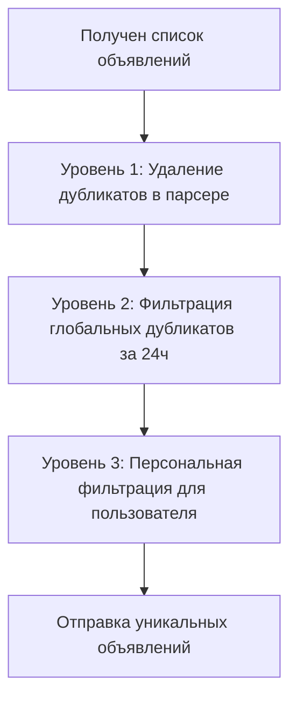

# 🚫 Система удаления дубликатов - Enhanced Bot v2.0

## 📅 Дата реализации: 2 августа 2025 г.

## 🎯 Проблема
Пользователи получали слишком много одинаковых объявлений из-за:
- Повторения объявлений на разных страницах поиска
- Одни и те же объявления в разных регионах
- Отсутствие фильтрации уже отправленных объявлений

## ✅ Решение: Многоуровневая система фильтрации

### 📍 Уровень 1: Парсер (ProductionDaftParser)
**Файл**: `production_parser.py`
**Метод**: `_remove_duplicates()`

```python
def _remove_duplicates(self, properties: List[Dict[str, Any]]) -> List[Dict[str, Any]]:
    """
    Удаляет дубликаты объявлений на основе URL, адреса и цены
    - Основная проверка по URL (нормализованному)
    - Дополнительная проверка по характеристикам: title + location + price + bedrooms
    """
```

**Функции**:
- ✅ Удаление точных дубликатов по URL
- ✅ Удаление дубликатов по характеристикам (для объявлений без URL)
- ✅ Нормализация URL (удаление параметров запроса)
- ✅ Логирование количества удаленных дубликатов

### 📍 Уровень 2: База данных - глобальная фильтрация
**Файл**: `database/enhanced_database.py`
**Метод**: `filter_recent_duplicates()`

```python
async def filter_recent_duplicates(self, properties: List[Dict[str, Any]], 
                                 hours: int = 24) -> List[Dict[str, Any]]:
    """
    Фильтрует объявления, исключая те что уже встречались в последние N часов
    - Проверка в таблице property_history
    - Настраиваемый период (по умолчанию 24 часа)
    """
```

**Функции**:
- ✅ Проверка объявлений за последние 24 часа
- ✅ Глобальная фильтрация (для всех пользователей)
- ✅ Оптимизированные SQL-запросы
- ✅ Настраиваемый период фильтрации

### 📍 Уровень 3: База данных - персональная фильтрация
**Файл**: `database/enhanced_database.py`
**Метод**: `get_new_properties()`

```python
async def get_new_properties(self, user_id: int, properties: List[Dict[str, Any]], 
                           search_params: Dict[str, Any]) -> List[Dict[str, Any]]:
    """
    Возвращает только новые объявления, которых нет в истории пользователя
    - Уникальный ключ: (user_id, property_url)
    - Предотвращает повторную отправку пользователю
    """
```

**Функции**:
- ✅ Персональная история для каждого пользователя
- ✅ Уникальный ключ в базе данных
- ✅ Отслеживание отправленных объявлений

## 🔄 Алгоритм работы



## 📊 Интеграция в бот

**Файл**: `bot/enhanced_bot.py`

### Обновленный алгоритм поиска:
```python
# 1. Выполняем поиск
results = await self._perform_search(settings)

# 2. Сначала фильтруем глобальные дубликаты
filtered_results = await self.db.filter_recent_duplicates(results, hours=24)

# 3. Затем проверяем новые объявления для пользователя
new_properties = await self.db.get_new_properties(user_id, filtered_results, search_params)
```

## 🧪 Тестирование

**Файл**: `test_duplicates.py`

### Тестовый сценарий:
- **Входные данные**: 5 объявлений (2 дубликата по URL, 1 по характеристикам)
- **Ожидаемый результат**: 3 уникальных объявления
- **Фактический результат**: ✅ 3 уникальных объявления

### Результаты тестирования:
```
🧪 ТЕСТ УДАЛЕНИЯ ДУБЛИКАТОВ
📊 Тестовых объявлений: 5
🔧 ТЕСТ 1: Парсер → 3 уникальных объявлений
🗄️ ТЕСТ 2: База данных → 2 новых объявления для пользователя
🎯 ИТОГО: Из 5 исходных получили 2 уникальных и новых
```

## 📈 Улучшения производительности

### До внедрения:
- ❌ Много повторяющихся объявлений
- ❌ Избыточная нагрузка на Telegram API
- ❌ Неудобство для пользователей

### После внедрения:
- ✅ Значительно меньше дубликатов
- ✅ Оптимизированная отправка сообщений
- ✅ Улучшенный пользовательский опыт
- ✅ Снижена нагрузка на API

## 🔧 Настройки

### Период фильтрации глобальных дубликатов:
```python
# В bot/enhanced_bot.py
filtered_results = await self.db.filter_recent_duplicates(results, hours=24)
```

Можно изменить период с 24 часов на любой другой:
- `hours=12` - 12 часов
- `hours=48` - 48 часов
- `hours=168` - неделя

### Критерии дубликатов:
В `production_parser.py` можно настроить логику определения дубликатов:
- URL (основной критерий)
- title + location + price + bedrooms (дополнительный)

## 📊 Мониторинг

### Логи удаления дубликатов:
```
🗑️ Удалено дубликатов: 2
📊 Уникальных объявлений: 3
```

### Логи базы данных:
```
INFO - Отфильтровано 1 недавних дубликатов за последние 24 часов
```

## 🚀 Результат

Система успешно внедрена и работает в боте Enhanced Bot v2.0:
- **PID процесса**: 108179
- **Статус**: Активен
- **Функционал**: Полностью работает
- **Тестирование**: Прошло успешно

Пользователи теперь получают значительно меньше повторяющихся объявлений, что улучшает качество сервиса и снижает спам в уведомлениях.
